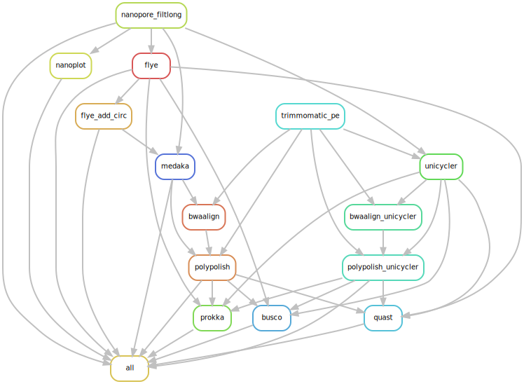

# Nanosake
A Snakemake workflow to quality control and assemble Nanopore data using Long reads first and Hybrid approach.

### Summary

The Nanosake workflow can be split into two parts - based on the type of data it uses first to assemble the reads (Long reads first Flye assembly vs Hybrid Unicycler assembly)

In short, it performs the following steps:

- Runs [Filtlong](https://github.com/rrwick/Filtlong) to remove low quality reads and discards reads less than 1000 Bp. (--min_length 1000 --keep_percent 95)
- Generates pre and post-Filtlong QC plots using [Nanoplot](https://github.com/wdecoster/NanoPlot).
- Assemble clean filtlong nanopore reads with [Flye](https://github.com/fenderglass/Flye) assembler.
- Flye-only assembly is then polished with long reads using Medaka, followed by polishing with clean trimmed illumina reads using [Polypolish](https://github.com/rrwick/Polypolish) - to generate Flye+Medaka+Polypolish assembly.
- For the short illumina read first approach, Long reads are assembled in hybrid mode using [Unicycler](https://github.com/rrwick/Unicycler) - medium mode, followed by polishing with short reads using Polypolish.
- The Flye-only, Flye+Medaka+Polypolish, Unicycler+Polypolish assembles the passes through [Prokka](https://github.com/tseemann/prokka) for annoatation, [BUSCO](https://busco.ezlab.org/) for assembly completeness statistics and [QUAST](https://quast.sourceforge.net/) for assembly statistics.

All the final assembly and annotation are finally placed in prokka directory.

## Installation

> Clone the github directory onto your system.

```
git clone https://github.com/alipirani88/Nanosake.git
```

The workflow makes use of singularity containers available from State Public Health - Bioinformatics group. If you are working on UMICH Great Lakes - you can load snakemake and singularity module in the following manner. If you are trying to run it on your local or other computing platform, make sure you have snakemake and singularity installed.

> Load bioinformatics and snakemake module from Great Lakes modules.

```
module load Bioinformatics
```

```
module load snakemake singularity
```

As an input, the snakemake file takes a config file where you can set the path to sample.tsv sample lookup file, path to your long and short reads, path to adapter fasta file etc. sample.tsv should be a comma seperated file, consisting of four columns - barcode_id(barcode id outputted by Minion or can be same as sample_id in case you dont have barcode information),sample_id (genome ID - this should be prefix that should be extracted from your illumina fastq reads),illumina_r1 (forward read 1),illumina_r2 (reverse read 2)

You can create sample.tsv file using the following for loop. It assumes that you are running for loop from the folder that contains your illumina short reads.
  
```

echo "barcode_id,sample_id,illumina_r1,illumina_r2" > sample.tsv

for read1 in *_R1.fastq.gz; do sample_id=`echo $i | sed 's/_R1.fastq.gz//g'`; read2=`echo $i | sed 's/_R1.fastq.gz/_R2.fastq.gz/g'`; echo $sample_id,$sample_id,$read1,$read2; done >> sample.tsv 

```

### Customize config.yaml and set tool specific parameters.

Set path to your sample.tsv, ONT long reads and illumina short reads path in config.yaml file.

## Quick start

### Run Nanosake on a set of samples.

```
snakemake -s Nanosake.smk -p --use-conda -j 999 --cluster "sbatch -A {cluster.account} -p {cluster.partition} -N {cluster.nodes}  -t {cluster.walltime} -c {cluster.procs} --mem-per-cpu {cluster.pmem}" --conda-frontend conda --cluster-config config/cluster.json --configfile config/config.yaml --latency-wait 1000
```




