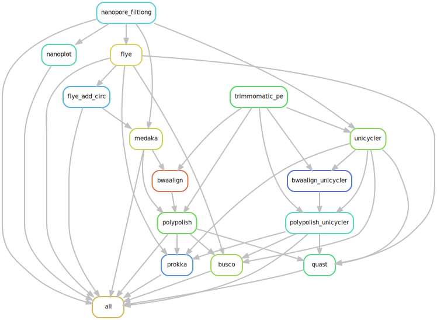

# Nanosake
A Snakemake workflow to quality control and assemble Nanopore data using Long reads first and Hybrid approach.

### Summary

The Nanosake workflow can be split into two parts - based on the type of data it uses first to assemble the reads (Long reads first Flye assembly vs Hybrid Unicycler assembly)

In short, it performs the following steps:

- Runs [Filtlong](https://github.com/rrwick/Filtlong) to remove low quality reads and discards reads less than 1000 Bp. (--min_length 1000 --keep_percent 95)
- Generates pre and post-Filtlong QC plots using [Nanoplot](https://github.com/wdecoster/NanoPlot).
- Assemble clean filtlong nanopore reads with [Flye](https://github.com/fenderglass/Flye) assembler.
- Flye-only assembly is then polished with long reads using Medaka, followed by polishing with clean trimmed illumina reads using [Polypolish](https://github.com/rrwick/Polypolish) - to generate Flye+Medaka+Polypolish assembly.
- For the short illumina read first approach, Long reads are assembled in hybrid mode using [Unicycler](https://github.com/rrwick/Unicycler) - medium mode, followed by polishing with short reads using Polypolish.
- The Flye-only, Flye+Medaka+Polypolish, Unicycler+Polypolish assembles the passes through [Prokka](https://github.com/tseemann/prokka) for annoatation, [BUSCO](https://busco.ezlab.org/) for assembly completeness statistics and [QUAST](https://quast.sourceforge.net/) for assembly statistics.

All the final assembly and annotation are finally placed in prokka directory.

## Installation

> Clone the github directory onto your system.

```
git clone https://github.com/alipirani88/Nanosake.git
```

> Load bioinformatics and snakemake module from Great Lakes modules.

```
module load Bioinformatics
```

```
module load snakemake singularity
```

### Customize the config.yaml according to your samples
Customise snakemake configuration settings in config/config.yaml file as per your needs and create a sample list file in config/samples.tsv

## Quick start

### Run Nanosake on a set of samples.

```
snakemake -s Nanosake.smk -p --use-conda -j 999 --cluster "sbatch -A {cluster.account} -p {cluster.partition} -N {cluster.nodes}  -t {cluster.walltime} -c {cluster.procs} --mem-per-cpu {cluster.pmem}" --conda-frontend conda --cluster-config config/cluster.json --configfile config/config.yaml --latency-wait 1000
```




